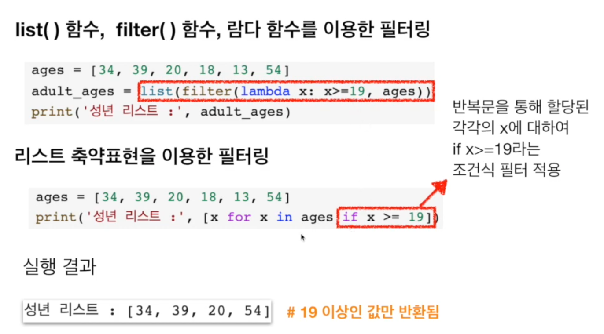
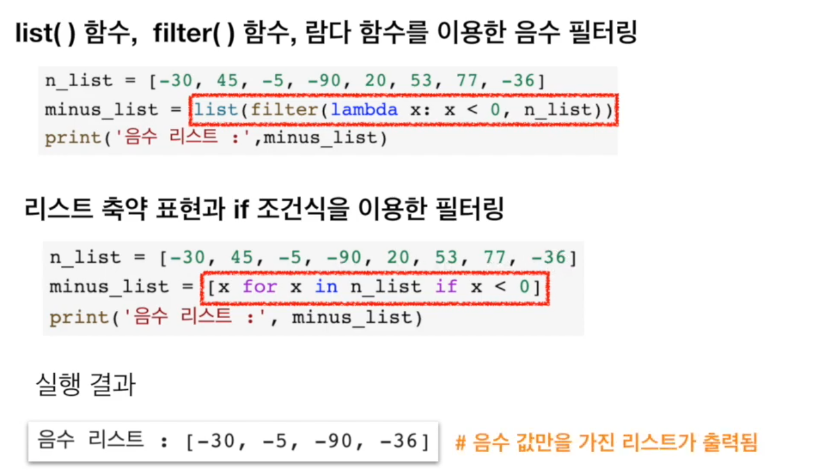
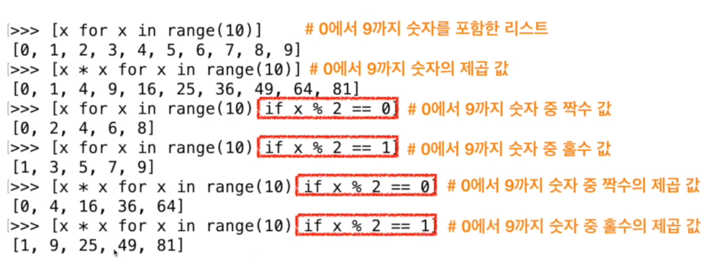
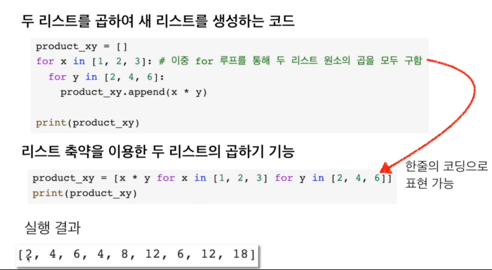
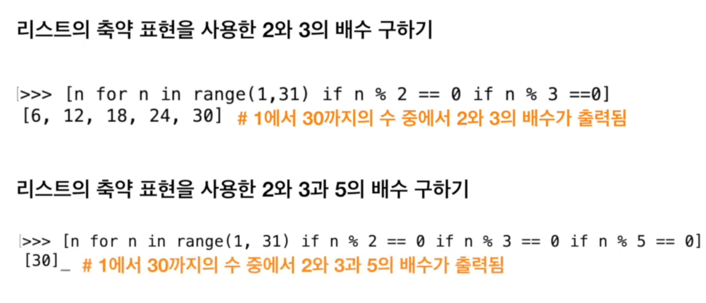
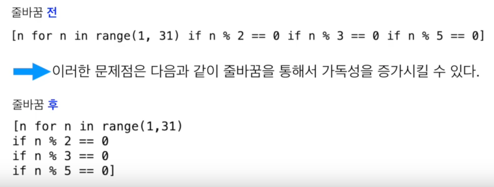
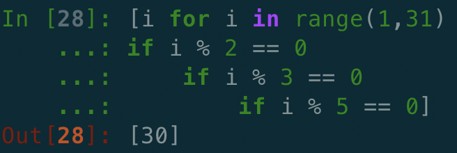

# 2. 리스트 축약 표현\(2\)

## if 조건식을 이용한 필터링

## 리스트의 축약 표현을 이용한 이중 for 루프 구

## 리스트의 축약 표현과 가독성

* 리스트의 축약 표현이 많은 장점을 가지고 있으나 지나치게 많은 조건을 넣거나 표현식을 복잡하게 만들면 이해하기가 매우 어려워 진다

* 너무 많은 축약은 가독성을 해칠 수 있다는 점을 항상 이해하고 읽기 좋은 코드를 만들기 위해 항상 노력해야 한

