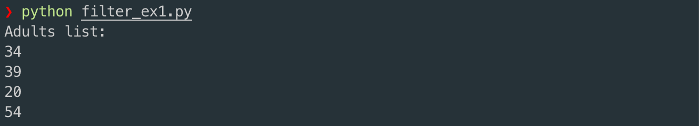
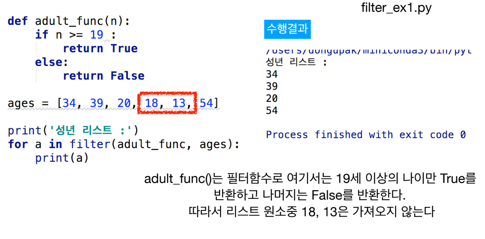
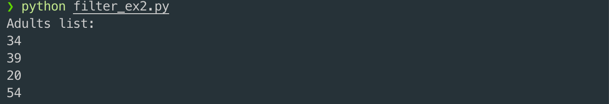
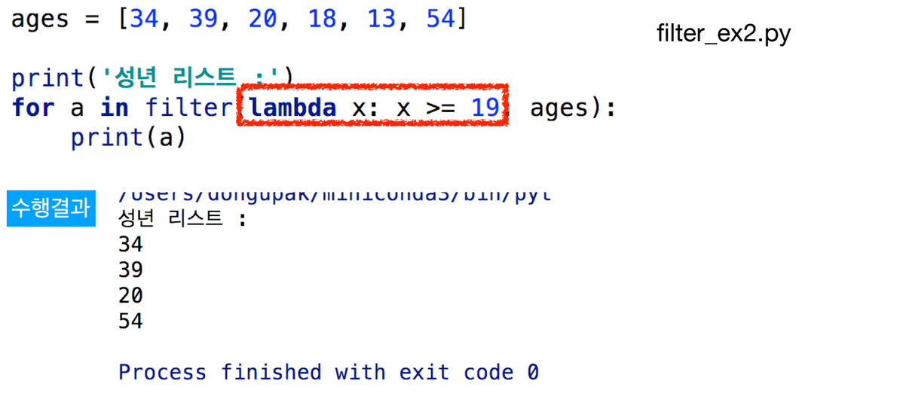
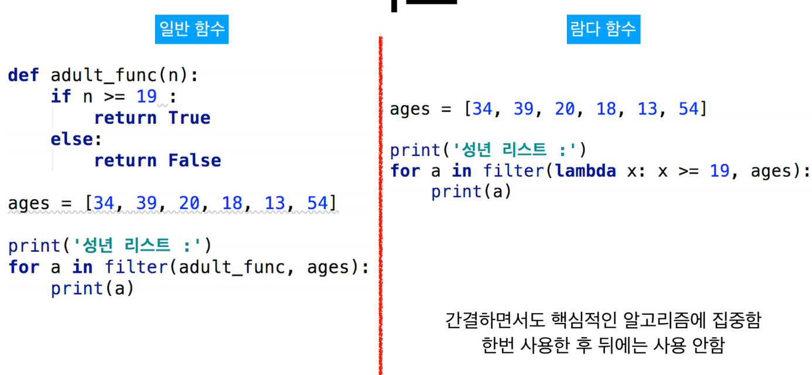
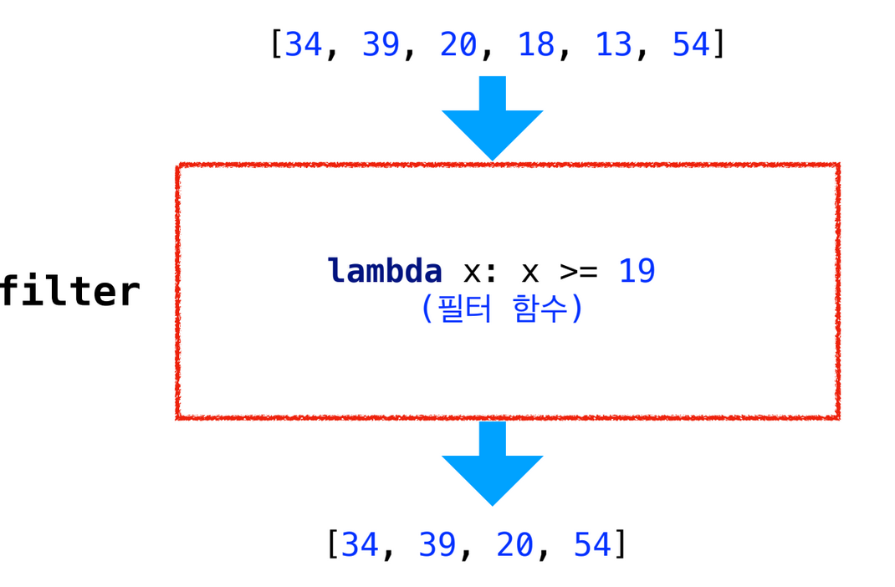
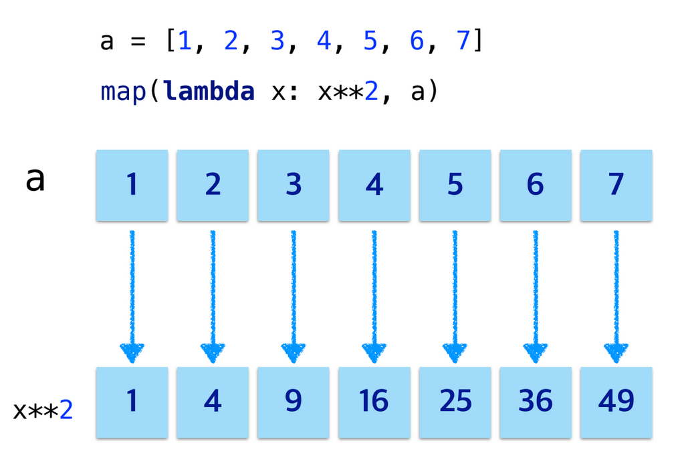
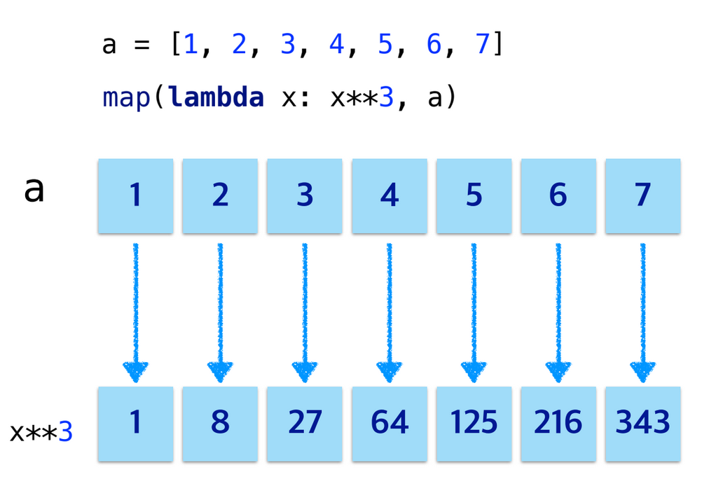
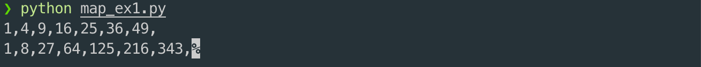

# 2. 필터 함수\(Filter Function\)와 맵 함수\(Map Function\)

## 필터 \(filter\) 함수와 람다 함

* 리스트에서 다룬 filter\( \) 함수는 순환가능한 요소들을 함수에 넣어 그 리턴 값이 참인 것만 묶어서 반환한다.

```python
def adult_func(n):
    if n >= 19:
        return True
    else:
        return False

ages = [34, 39, 20, 18, 13, 54]
print("Adults list: ")
for i in filter(adult_func, ages):
    print(i)
```





* 앞의 adult\_func\( \)는 필터에서 사용할 1회용 함수로 람다를 이용하여 다음과 같이 단순화하는 것이 더욱 편리하다

```python
ages = [34, 39, 20, 18, 13, 54]

print("Adults list: ")
for i in filter(lambda x : x >= 19, ages):
    print(i)
```





## 비교





## 맵\(map\) 함수와 람다

* 파이썬은 map\( \) 이라는 내장함수를 제공하는데 열거가능한 자료형의 각 요소들에 대해서 매핑 함수를적용한다
* 리스트의 모든 원소에 대해 제곱과 세제곱을 수행하는 lambda 함수를 만들어보자.





```python
a = [1, 2, 3, 4, 5, 6, 7]
square_list = map(lambda x: x**2, a)
cubic_list = map(lambda x: x**3, a)

for i in square_list:
    print(i, end=',')

print()

for i in cubic_list:
    print(i, end=',')
```



