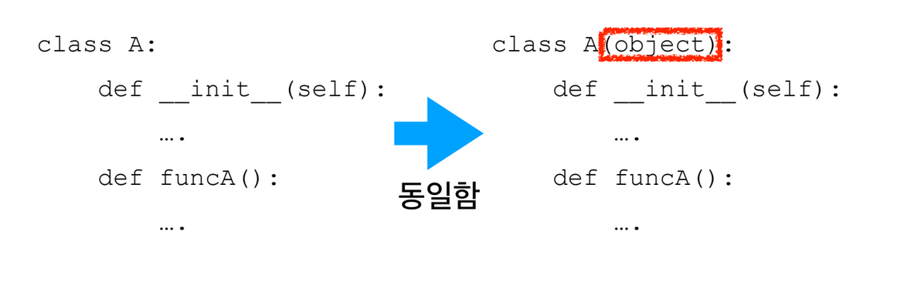
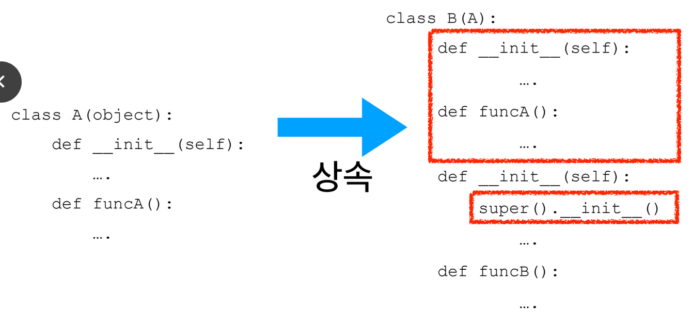
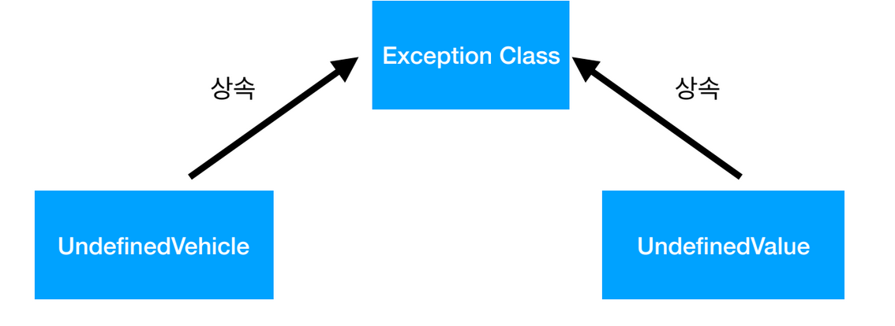
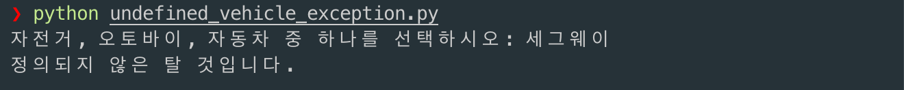
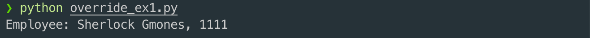
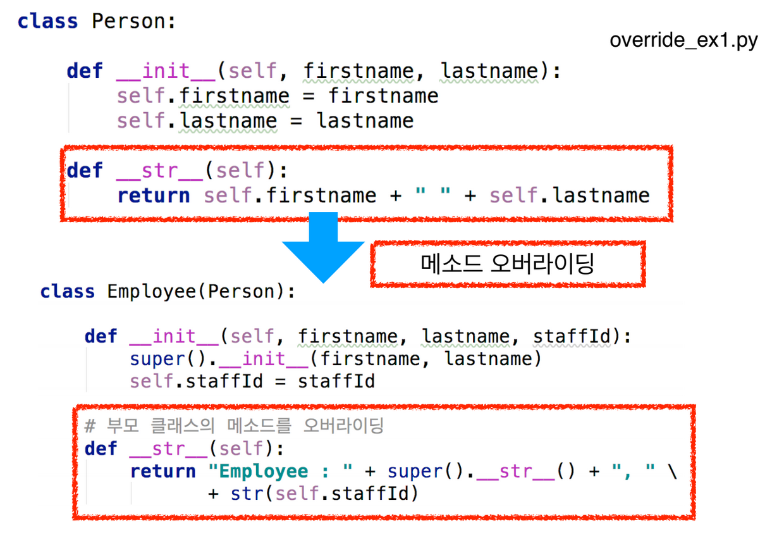

# 2. Object 클래스와 Overriding

## Object 클래스

* 파이썬은 객체지향 프로그래밍 언어로 코드의 재사용성과 유지보수가 뛰어나다
* 파이썬 2에서는 Object 클래스로부터 상속받는 것을 명시적으로 넣어야 했으나 파이썬 3은 Object 클래스를 부모 클래스로 명시하지 않아도 default 부모 클래스로 지정된다
  * Object 클래스는 모든 클래스가 가져야 할 기본적인 메서드를 가지고 있다. 그리고 필요할 경우 자식 클래스는 이 메서드를 오버라이딩해서 사용할 수 있
* 파이썬 라이브러리에는 Object 클래스가 정의되어 있다
* Object 클래스에 정의된 메서드는 \_\_new\_\_\( \), \_\_init\_\_\( \), \_\_str\_\_\( \), \_\_eq\_\_\( \)메서드와 같은 특수 메서드이다.



## 특수 메서드

* \_\_eq\_\_\( \): 두 객체가 서로 동일하다면 True를 반환한다. 따라서  A.\_\_eq\_\_\(A\) 는 True 이며 A.\_\_eq\_\_\(B\) 는 False 이다
  * 이 메서드를 오버라이딩하여 두 객체의 값이 같을 때 True 를 반환하도록 할 수 있다.
* \_\_new\_\_\( \): 이 메서드는 객체가 생성될 때 자동으로 호출되는데, \_\_init\_\_\( \) 메서드보다 먼저 호출된다. 이 메서드는 새로운 인스턴스의 생성시에 해야할 코드를 가지고 있으며 인스턴스를 반환한다.
  * 반면 \_\_init\_\_\( \)은 아무런 인스턴스도 반환하지 않으며, 객체 생성 후 초기화에 관계된 일을 한다.

## 상속

* 상속을 통해서 자식 클래스는 부모 클래스의 접근 가능한 데이터 필드와 메서드를 물려받는다.



## 예외 상속

* 사용자가 직접 예외처리를 하면 코드의 직관성을 높일 수 있다.
* 파일을 하나 만들어 예외를 정의해 두고,
* Exception 클래스를 상속받도록 한다.
* raise 문을 통해서 예외를 생성해 본다.



```python
class UndefinedVehicle(Exception):
    def __str__(self):
        return "정의되지 않은 탈 것입니다."

vehicle = input("자전거, 오토바이, 자동차 중 하나를 선택하시오: ")

try:
    if vehicle not in ['자전거', '오토바이', '자동차']:
        raise UndefinedVehicle
except UndefinedVehicle as e:
    print(e)
```



## 메서드 오버라이딩 \(Method Overriding\)

* 자식 클래스는 부모 클래스의 메서드를 상속 받는다.
* 때때로 부모 클래스에서 구현된 메서드를 자식 클래스에서 수정할 필요가 있는데 이 것을 메서드 오버라이딩이라고 한다
* 15.3 절에서 살펴본 \_\_str\_\_ 메서드는 인스턴스를 출력할 때 형식 지정하는 메서드로 문자열 객체를 반환한다.
  * 이 메서드는 자식 클래스가 적절하게 수정해서 사용할 수 있다.

```python
class Person:
    def __init__(self, firstname, lastname):
        self.firstname = firstname
        self.lastname = lastname
    
    def __str__(self):
        return self.firstname + ' ' + self.lastname

class Employee(Person):
    def __init__(self, firstname, lastname, staffId):
        super().__init__(firstname, lastname)
        self.staffId = staffId
    
    # 부모 클래스의 메서드를 overriding
    def __str__(self):
        return "Employee: {}, {}".format(super().__str__(), str(self.staffId))

worker = Employee("Sherlock", "Gmones", 1111)
print(worker)
```





