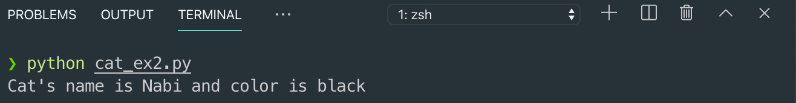

# 2. 클래스의 정의와 self

## 클래스\(Class\) 만들기

* 클래스를 사용하는 이유는 추상화된 현실의 개념을 구체적인 파이썬 코드로 표현하기 위해서이다.


## 클래스\(Class\) 정의하기


## 클래스\(Class\), 인스턴스\(Instance\) 생성


## 클래스와 인스턴스 만들

```python
class Cat:
    def meow(self):
        print("Meow meow~~")

cat1 = Cat()
cat1.meow()
```


## 인스턴스 변수 생

```python
class Cat:
    def info(self):
        # 인스턴스 변수 name, color 생성
        self.name = "Nabi"
        self.color = "black"
        
        print("Cat's name is {} and color is {}"\
            .format(self.name, self.color))

cat = Cat()
cat.info()
```



## self

* 파이썬의 self는 클래스의 인스턴스를 지칭하며 self 키워드를 통해 클래스의 메서드와 속성에 접근할 수 있다.
* 클래스 안의 모든 메서드의 첫 번째 매개변수는 자기 자신을 가리키는 self 변수이다. 즉 이 메서드를 호출한 현재 객체를 의미한다.

```python
class Cat:
    # 초기화 메서드
    def __init__(self, name = 'Nabi', color = 'white'):
        self.name = name
        self.color = color
    
    def info(self):
        print("Cat's name is {} and color is {}"\
            .format(self.name, self.color))

# cat1 인스턴스 생성
cat1 = Cat("Nero", "black")
# cat2 인스턴스 생성
cat2 = Cat("Mimi", "brown")

cat1.info()
cat2.info()

```


