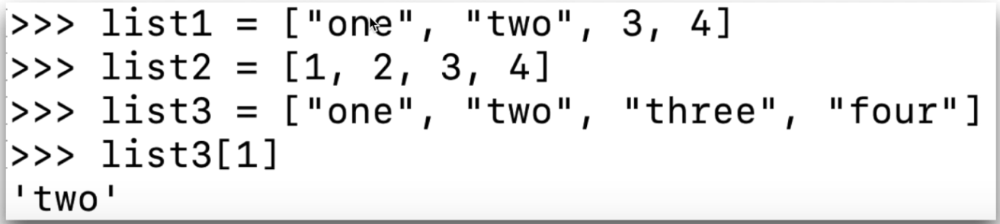
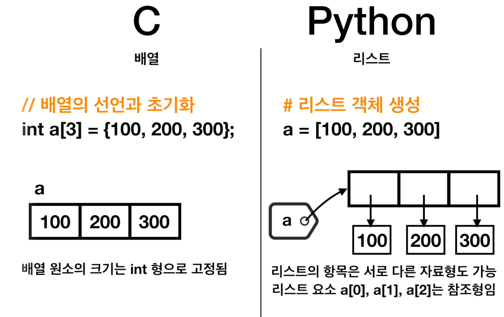
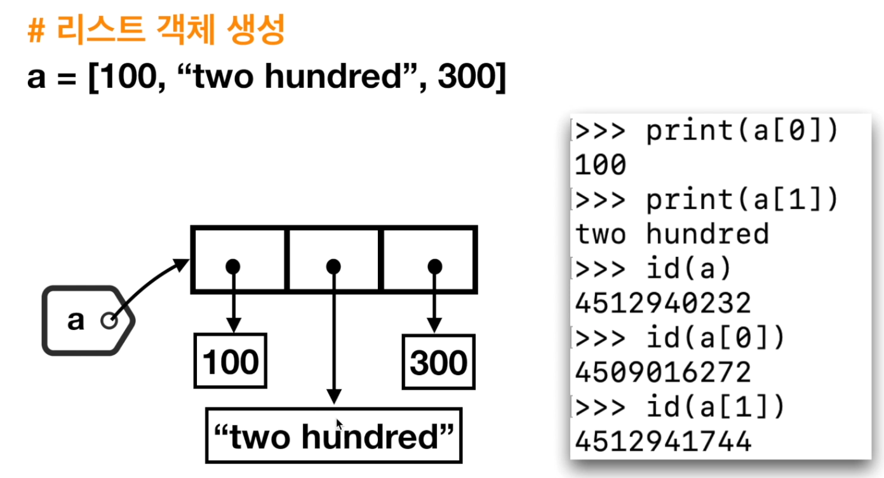
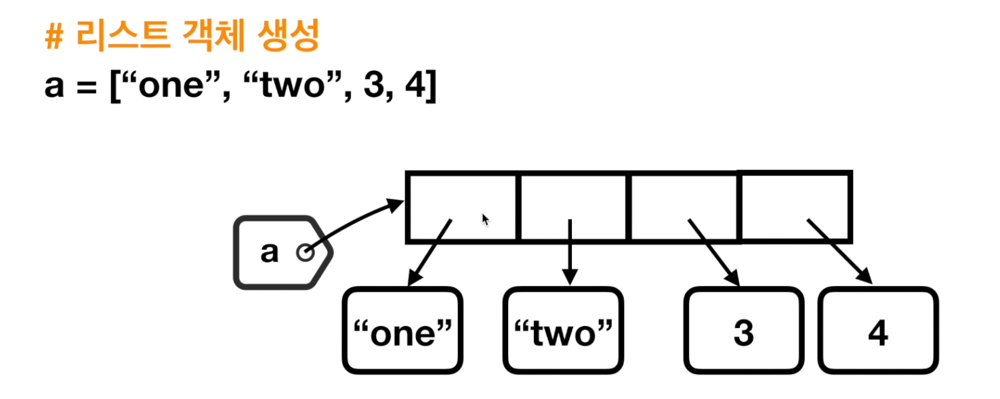
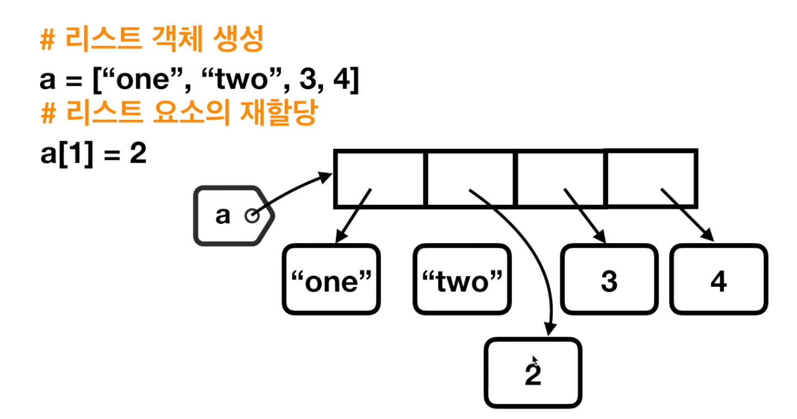
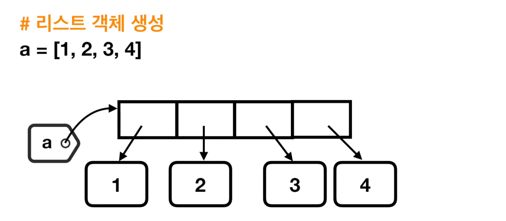
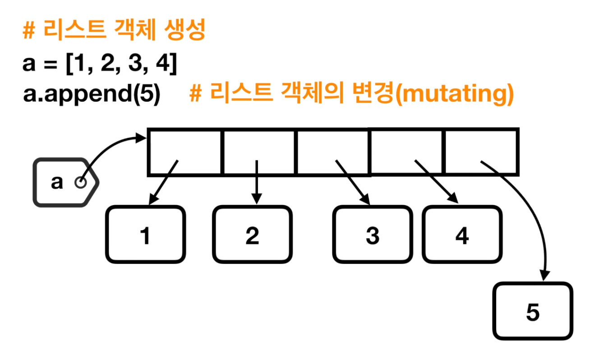
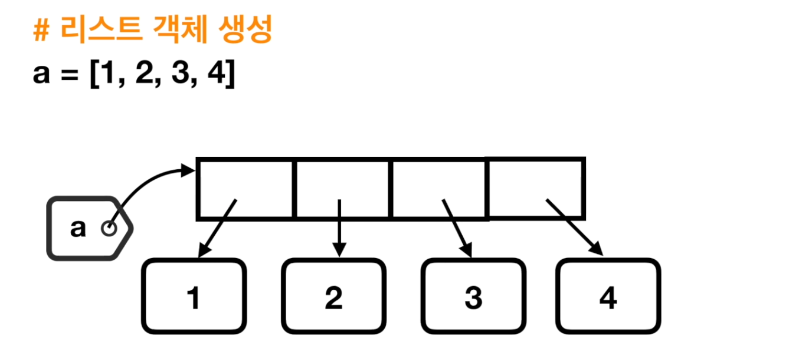
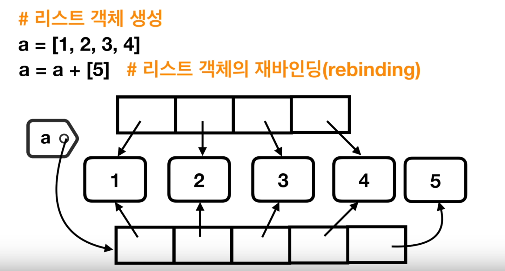

# 2. 리스트 요소는 참조형이다

## 리스트

* 파이썬의 리스트는 타 언어의 배열과 비슷해 보인\(?\)
* 하지만, 하나의 리스트에 서로 다른 자료형의 항목을 포함시킬 수 있다 \(리스트, 딕셔너리 등을 포함할 수 있다\)
* 매우 강력한 기능이 있는 자료형이다

* 즉 파이썬의 모든 요소는 참조형이므로, 하나의 리스트에 서로 다른 자료형의 항목을 포함시킬 수 있는 것이다

## Elements are References

* 리스트 요소는 참조형이다!

## 리스트 요소의 재할

## 리스트 요소의 추

## 리스트의 덧셈과 재할

## Lab

![a &#xC640; a + \[5\] &#xC758; &#xC8FC;&#xC18C;&#xB294; &#xB2E4;&#xB974;&#xC9C0;&#xB9CC;, a\[0\] &#xC758; &#xC8FC;&#xC18C;&#xB294; &#xADF8;&#xB300;&#xB85C; &#xAC19;&#xB2E4;](.gitbook/assets/2019-12-29-2.08.37.png)

![100 &#xACFC; a\[0\] &#xC758; &#xC8FC;&#xC19F;&#xAC12;&#xC740; &#xAC19;&#xC73C;&#xB098;, two hundred &#xC640; a\[1\] &#xC758; &#xC8FC;&#xC18C;&#xB294; &#xAC19;&#xC9C0; &#xC54A;&#xB2E4;](.gitbook/assets/2019-12-29-2.12.11.png)

## Summary

* 리스트 객체는 변경가능\(mutable\) 객체
  * int 형, tuple 형, str 형 객체는 변경불가능\(immutable\)  객체
* 리스트의 append\( \) 메서드는 객체의 내용을 변경시킴
* 리스트의 + 연산은 새로운 객체로 복사해서 재바인딩 

