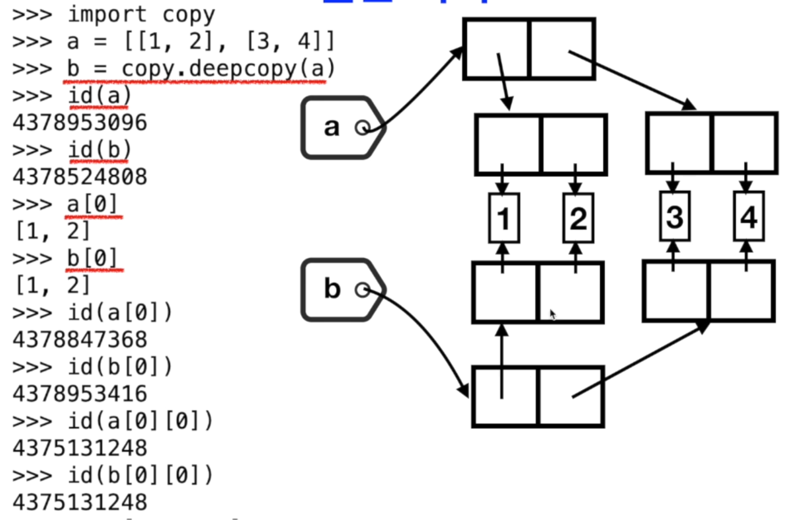

# 3. 할당, 얕은 복사와 깊은 복사

## 파이썬 리스트

* 리스트는 변경가능\(mutable\) 자료형이다
* 객체 a 를 다른 객체 b 에 할당할 때\(즉 b = a 연산\) 데이터의 복사가 발생하지 않는다\(효율성의 증대\) \(리스트, 정수형 등 모든 자료형\)

## 단순 할당

## 얕은 복\(Shallow Copy\)

![id\(a\[0\]\) &#xC640; id\(b\[0\]\) &#xB294; &#xAC19;&#xC740; &#xC8FC;&#xC18C;&#xC774;&#xB098;, id\(a\) &#xC640; id\(b\) &#xB294; &#xB2E4;&#xB978; &#xC8FC;&#xC18C;&#xC774;&#xB2E4;.](.gitbook/assets/2019-12-29-2.27.19.png)

## 깊은 복사 vs 얕은 복사

* 얕은 복사와 깊은 복사의 차이점은 리스트나 클래스의 인스턴스와 같은 복합 객체에 대해서만 적용된다.
  * 얕은 복사는 새 복합 객체를 만들고 원본 객체 내에 있는 오브젝트에 대한 참조를 삽입한다
  * 깊은 복사는 새 복합 객체를 만들고 원본 객체 내에 있는 객체에 대한 복사를 재귀적으로 삽입한다

## 깊은 복사

* copy 모듈의 deepcopy\( \) 함수를 통해서 수행한
  *  b = copy.deepcopy\(a\)
* 깊은 복사를 하게되면 얕은 복사에서 할 수 없는 연산을 할 수 있다
  * 재귀적인 객체\(자기 자신에 대한 직,간접 참조가 포함된 복합 객체를 말함\)에 대한 참조는 재귀 루프에 빠질 수 있다
  * 깊은 복사를 하면 두 복사본이 공유하려고 한 데이터에 대해서도 너무 많은 복사를 할 수 있
* 리스트를 요소로 가지는 리스트

## Lab

### 단순 할

### 얕은 복사

## 깊은 복사

## 깊은복사: Mutation

## 깊은 복사: 참조에 대한 재귀적 복사

## Summary

* 파이썬의 할당 연산 b = a
  * 단순 참조\(객체에 대한 참조가 생성되는 복사\)
* 얕은 복사: 리스트에서 b = a\[:\] 복
  *  a의 각 객체를 참조하는 요소를 새로 생성함
  * 이를 b가 참조하는 얕은 복사
* 깊은 복사: 객체에 대한 재귀적인 참조 객체가 생성되는 참조
  * 복합 객체에 대해서만 적용된다
  * b = copy.deepcopy\(a\)

