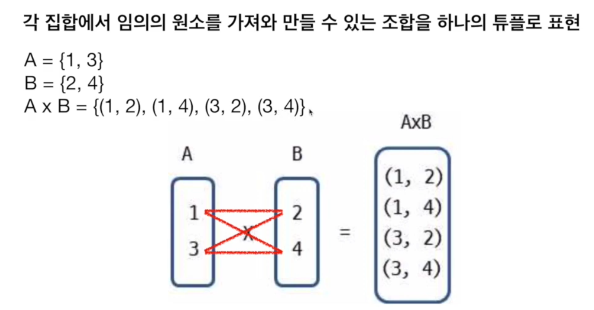
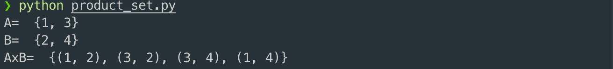
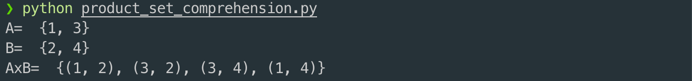

# 3. 집합과 튜플 축약

## 곱집합



```python
def product_set(set1, set2):
    res = set()
    for i in set1:
        for j in set2:
            res = res | {(i, j)}
    return res

A = {1, 3}
B = {2, 4}
AxB = product_set(A, B)
print("A= ", A)
print("B= ", B)
print("AxB= ", AxB)
```



## 축약 표현으로 구한 곱집합

```python
def product_set(set1, set2):
    return {(i, j) for i in set1 for j in set2}

A = {1, 3}
B = {2, 4}
AxB = product_set(A, B)
print("A= ", A)
print("B= ", B)
print("AxB= ", AxB)
```




