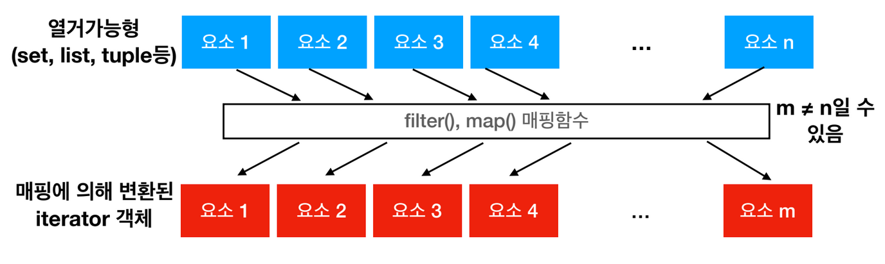
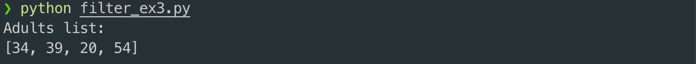
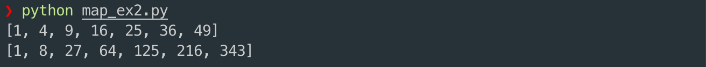
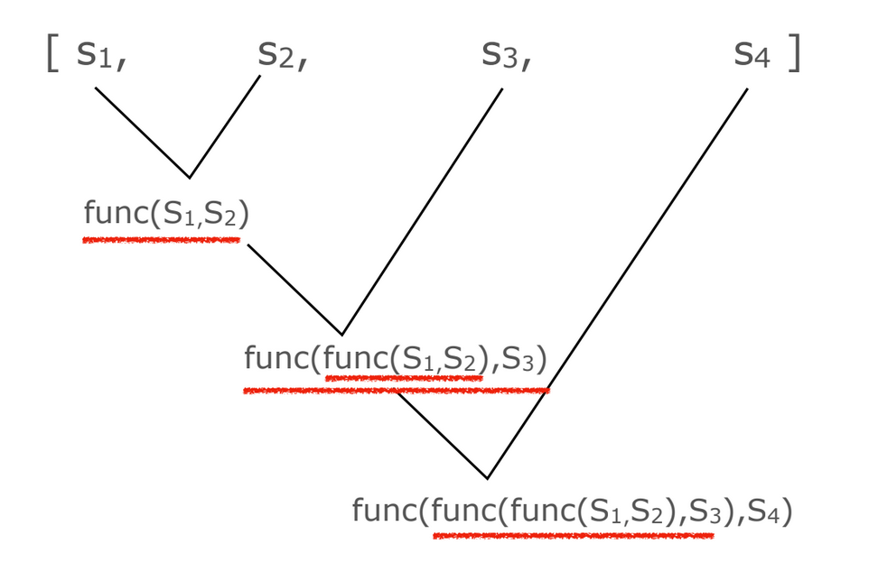
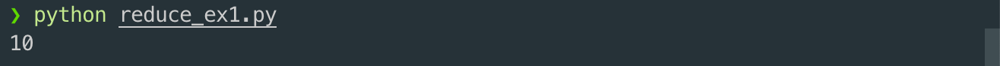
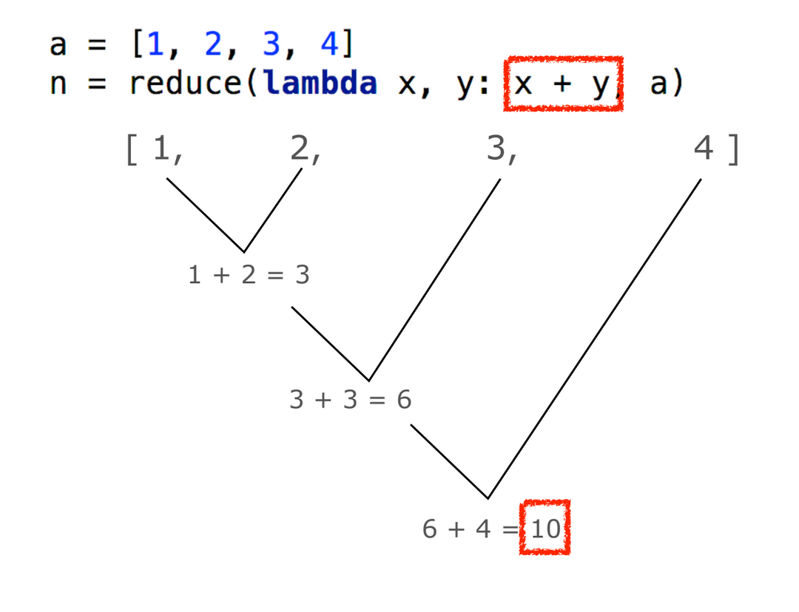
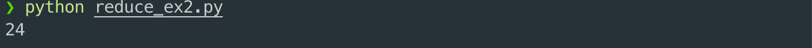
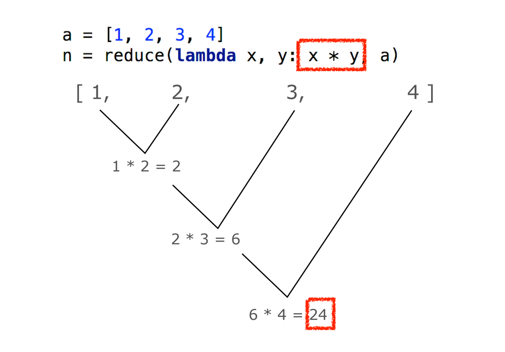
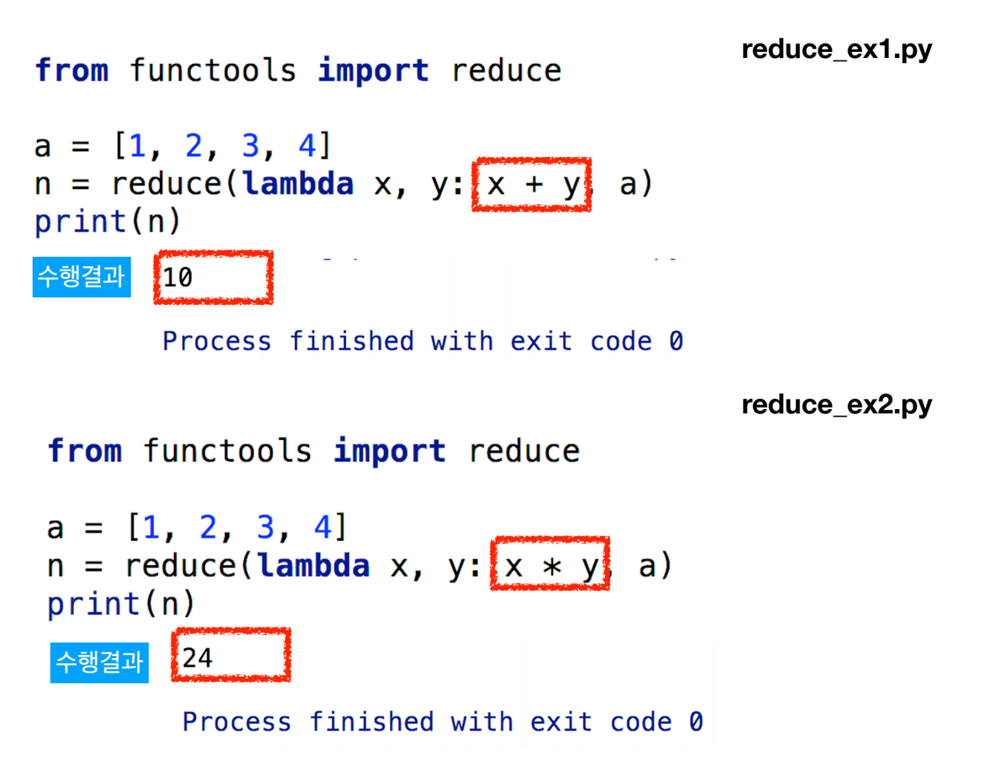

# 3. 리듀스\(Reduce\) 함수

## 필터와 맵

* 파이썬은 filter\( \), map\( \) 이라는 내장함수를 제공하는데 열거가능한 \(iterable\) 자료형의 각 요소에 대해서 매핑 함수를 적용한다
  * 이 함수들이 반환하는 것은 각각 iterable 객체이며, 이 객체는 list\( \) 함수를 이용하여 간단하게 리스트 형으로 만들 수 있다.



```python
ages = [34, 39, 20, 18, 13, 54]

print("Adults list: ")
adult_ages = list(filter(lambda x: x >= 19, ages))
print(adult_ages)
```



```python
a = [1, 2, 3, 4, 5, 6, 7]
square_list = list(map(lambda x: x**2, a))
cubic_list = list(map(lambda x: x**3, a))

print(square_list)
print(cubic_list)
```



## reduce\( \)

* 리듀스 함수는 functools 모듈에 포함되어 있는데 순환 가능 요소들을 같은 방법으로 연산하여 하나의 값을 얻는데 사용할 수 있다
  * 문제는 이 결론을 얻는 것이 쉽게 이해하기 어렵다는 점이다.
* seq = \[s₁, s₂, s₃, s₄\] 라는 리스트가 있고 reduce\(func, seq\)가 호출되면 다음과 같은 작업이 이루어진다



```python
from functools import reduce

a = [1, 2, 3, 4]
n = reduce(lambda x, y: x + y, a)
print(n)
```





```python
from functools import reduce

a = [1, 2, 3, 4]
n = reduce(lambda x, y: x * y, a)
print(n)
```








