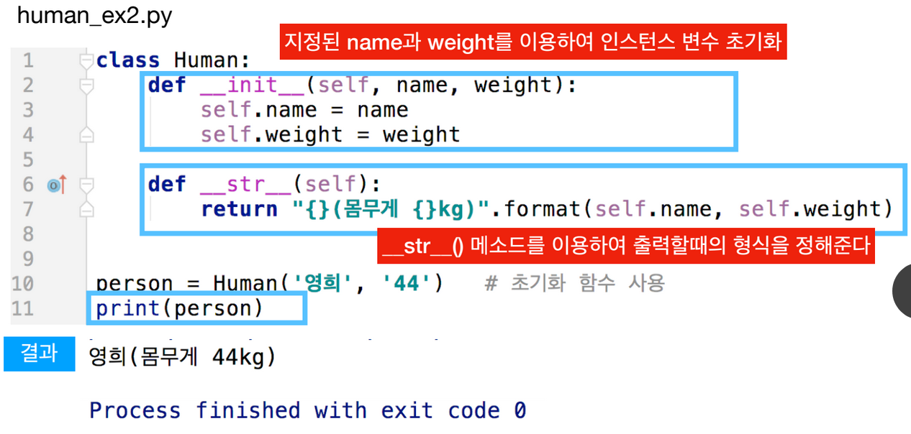

# 3. 생성자와 문자열화 메서드

## 메서드 \(Method\)

* 메서드\(Method\)는 클래스가 가진 함수로 클래스에 묶여서 인스턴스와 관계되는 일을 하는 함
  *  . 연산을 이용


```python
class Human:
    # 객체의 초기화를 담당하는 생성자
    def __init__(self, name, age):
        self.name = name
        self.age = age

    def info(self):
        print("Name: {}, Age: {}".format(self.name, self.age))

    def call(self):
        print("Call {}".format(self.name))

person = Human("Suzy", 23)
person.info()
person.call()

guy = Human("Hong", 27)
guy.info()
guy.call()
```


## 특수 메서드


## 생성

* 객체를 만들 때 인스턴스 변수가 기본값을 가지면 더 좋을 것이다
* 생성자를 이용하여 지정한 초기 상태값을 가진 채로 만들 수 있다
* \_\_init\_\_\( \) 메서드에 초기 상태값을 설정한다.이 메서드를 다른 말로 생성자라고 한다.
* 이 생성자 메서드는 객체가 생성될 때 자동으로 호출된다.

## 클래스 생성자, 문자열 

```python
class Human:
    def __init__(self, name, age):
        self.name = name
        self.age = age
    
    def __str__(self):
        return "{}(Age: {})".format(self.name, self.age)

# 초기화 함수 사용
person = Human("Suzy", 23)
print(person)
```




* \_\_str\_\_\( \) 함수는 특별한 기능이 있는데, print\(person\)과 같이 print\( \) 함의 인자로 객체가 넘어가면 자동으로 호출되는 기능이 있다
  * 즉 print\(person\) 은 print\(person.\_\_str\( \)\) 과 동일하다.

## 특수 메서

* 파이썬에는 연산자\(+, -, \*, /, ==, %, //, \*\*, &lt;&lt;, &gt;&gt;, ...\)에 관련된 특수한 메서드가 있다. 이 메서드들은 연산자들과 관련이 있다.


