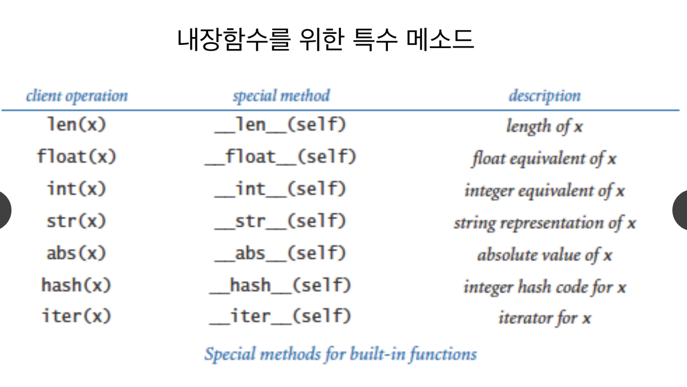

# 4. 인스턴스 연산과 특수 메서드

## 인스턴스 관련 연산자

* is 연산자
  * is 연산은 두 인스턴스가 같은 인스턴스인지 검사한다
* == 연산자
  * == 연산은 두 인스턴스의 데이터 값이 같은지 확인한다.

## 인스턴스 연산자 예


```python
list1 = [1, 2, 3]
list2 = [1, 2, 3]

if list1 is list1:
    print("list1과 list2는 같은 인스턴스 입니다.")

if list1 == list2:
    print("list1, list2의 데이터 값은 동일하며")
    if list1 is list2:
        print("list1과 list2는 같은 인스턴스입니다")
    else:
        print("하지만 list1과 list2는 다른 인스턴스 입니다")
```


## 특수 메서

* 2차원 벡터를 표현하는 Vector2D 라는 클래스를 구현해 보자
* 이 클래스의 인스턴스에 덧셈과 뺄셈을 +, - 연산자로 시도해 보
  *  에러 발생: 인스턴스 위한 +, - 연산이 정의되어 있지 않다.
  * 덧셈과 뺄셈을 위해서는 \_\_add\_\_\( \) 와 \_\_sub\_\_\( \) 의 특수 메서드를 구현해야만 +, - 연산자를 사용할 수 있다.





