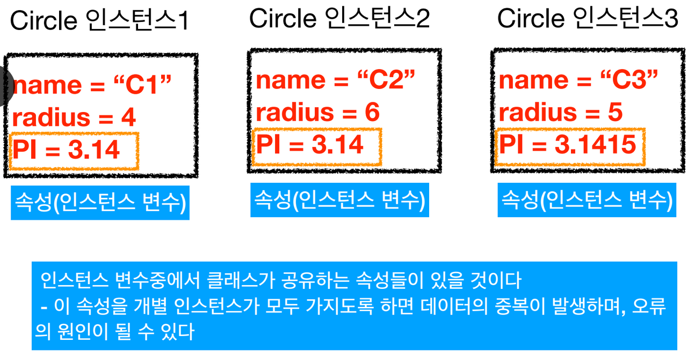
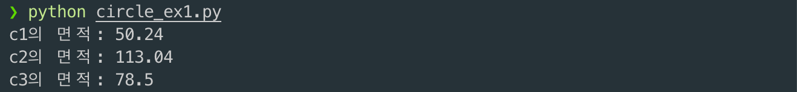

# 5. 클래스 변수와 \_\_dict\_\_

## 인스턴스 변



```python
class Circle:
    def __init__(self, name, radius):
        self.name = name
        self.radius = radius
        # 개별적인 인스턴스들이 PI를 변수로 가짐
        self.PI = 3.14

    # 현재 인스턴스의 PI에 반지름 ** 2 를 곱하여 면적을 구함
    def area(self):
        return self.PI * self.radius ** 2

c1 = Circle("C1", 4)
print("c1의 면적:", c1.area())
c2 = Circle("C2", 6)
print("c2의 면적:", c2.area())
c3 = Circle("C3", 5)
# c3.PI = 3.141592
print("c3의 면적:", c3.area())
```



* 따라서 오류를 방지하기 위해 인스턴스 변수 대신 다른 것을 사용해야 한다.

## 클래스 변


* 따라서 개별 인스턴스들은 PI = 3.14 라는 값을 이제 더이상 유지할 필요가 없다.

```python
class Circle:
    PI = 3.14 # 클래스 변수의 선언, 인스턴스들이 굥유함
    def __init__(self, name, radius):
        self.name = name
        self.radius = radius

    def area(self):
        return Circle.PI * self.radius ** 2

c1 = Circle("C1", 4)
print("c1의 면적:", c1.area())
c2 = Circle("C2", 6)
print("c2의 면적:", c2.area())
c3 = Circle("C3", 5)
print("c3의 면적:", c3.area())
```


## \_\_dict\_\_ 속성

* 파이썬 클래스는 디폴트 속성들과 특수 메서드들이 있다.
  * ex: \_\_str\_\_\( \), \_\_init\_\_\( \)과 같은 특수 메서드
* \_\_dict\_\_ 속성은 객체의 속성을 저장하는데 사용되는 딕셔너리 속성이다.
  * 딕셔너리: 키\(Key\)-값\(Value\) 쌍을 갖는 자료형으로 키\(Key\)를 이용하여 값\(Value\)을 참조할 수 있다.
  * 객체가 가진 여러 속성을 확인하는데 유용하다.

```python
class Circle:
    PI = 3.14

    def __init__(self, name, radius):
        self.name = name
        self.radius = radius

    def area(self):
        return Circle.PI * self.radius ** 2

c1 = Circle("C1", 4)
print("c1의 속성들:", c1.__dict__)
print("c1의 name 변수값:", c1.__dict__['name'])
print("c1의 radius 변수값:", c1.__dict__['radius'])
```


## 클래스의 속성

* 클래스의 속성으로는 디폴트로 다음과 같은 것들이 있다.
  * \_\_dict\_\_
  * \_\_module\_\_
  * \_\_init\_\_
  * \_\_weakref\_\_
  * \_\_doc
  * 클래스의 속성에 대한 키-값 정보, 클래스가 속한 함수등의 부가적인 정보들이 있음

