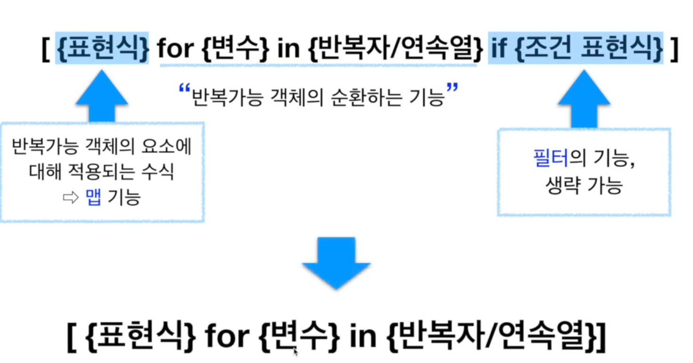
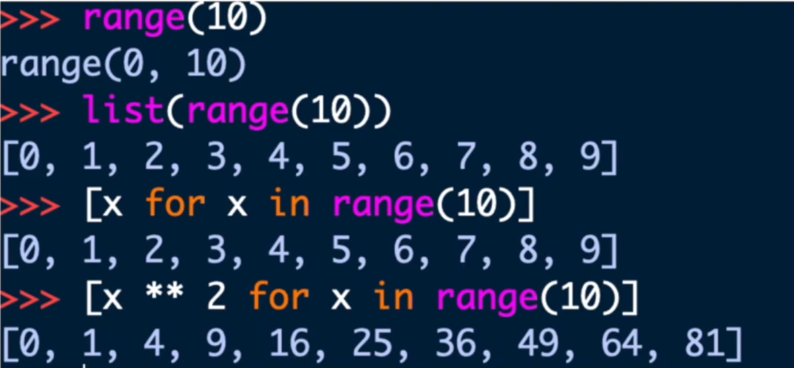
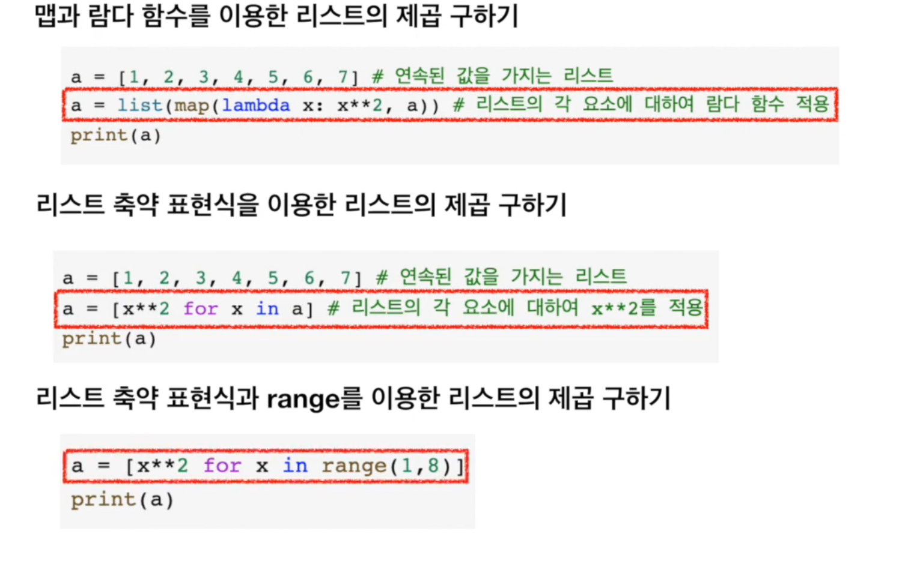
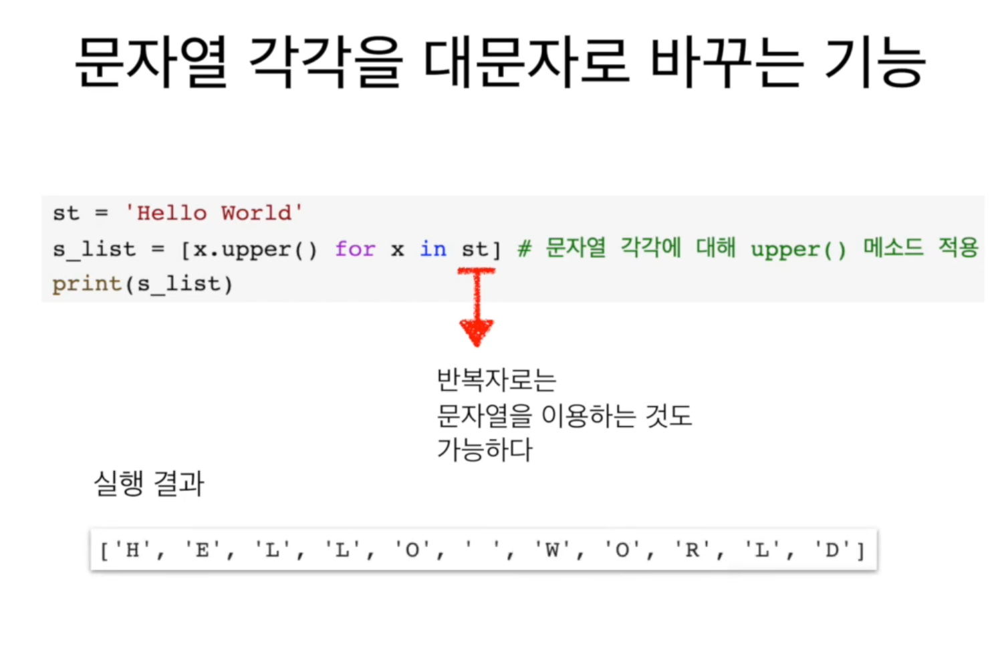
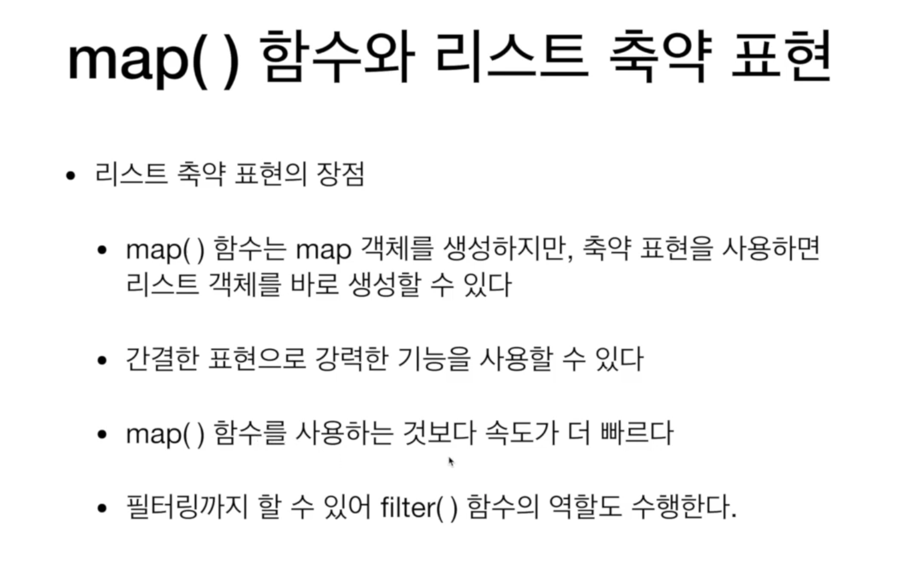

# 1. 리스트 축약 표현\(1\)

## 리스트 축약

* 리스트의 축약 표현\(list comprehension\) 이란?
  * 반복 가능 객체를 이용하여 쉽게 리스트를 생성할 수 있는 기능
  * map, filter 기능 구현 가능
  * 람다식의 본체가 될 식을 그대로 사용하기 때문에 따로 람다함수를 정의할 필요가 없다
  * 리스트 뿐만 아니라 집합과 같은 반복가능한 모든 객체에 대해 적용할 수 있다

## 리스트 축약의 문법

