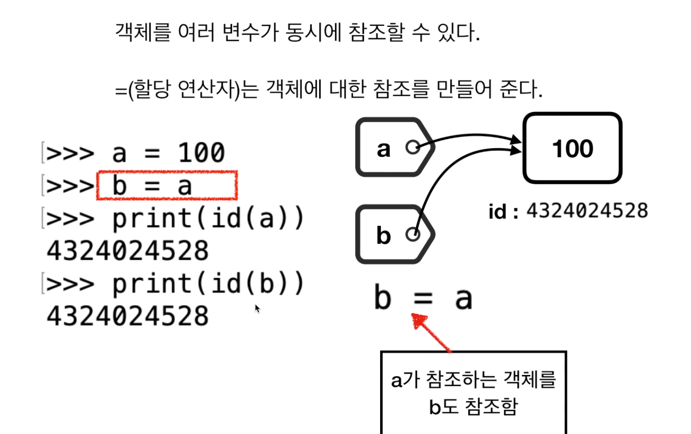

# 1. 파이썬 객체와 참조 변수

## Everything is ab Object

* 파이썬은 객체지향 프로그래밍 언어이
*  파이썬은 객체가 중심이 되며, 참조 변수를 통해 객체에 접근할 수 다
* C 언어는 변수가 생성되고 변수에 값이 저장되는 구조이다.
* 파이썬의 변수는 동적으로 참조하는 객체가 지정된다.

## 자료형

* 파이썬은 정수형, 실수형, 복소수형, 문자열, 리스트 등의 다양한 자료형이 있다.
* 자료형에 따라서 지원하는 연산자가 다르며 메서드들도 다르다
* 사용자의 필요성에 따라 적절한 자료형을 선택하여 사용한

## 정수 객체와 변

* 정수형 객체가 있으면 이 객체에 연산자를 적용하여 연산을 수행할 수 있다
* 변수에 데이터를 보관하고 필요할 때 참조하면 편리하다

## 모든 객체는 고유한 id를 가진다

## = 연산자가 하는 일 

* 객체에 대한 참조를 만들거나 변경시킨다
* 파이썬은 객체 중심적인 프로그래밍 언어이므로 객체와 객체를 참조하는 변수, 그리고 참조의 변경이라는 개념이 중요할 수 밖에 없
*  객체를 여러 변수가 동시에 참조할 수 있다

