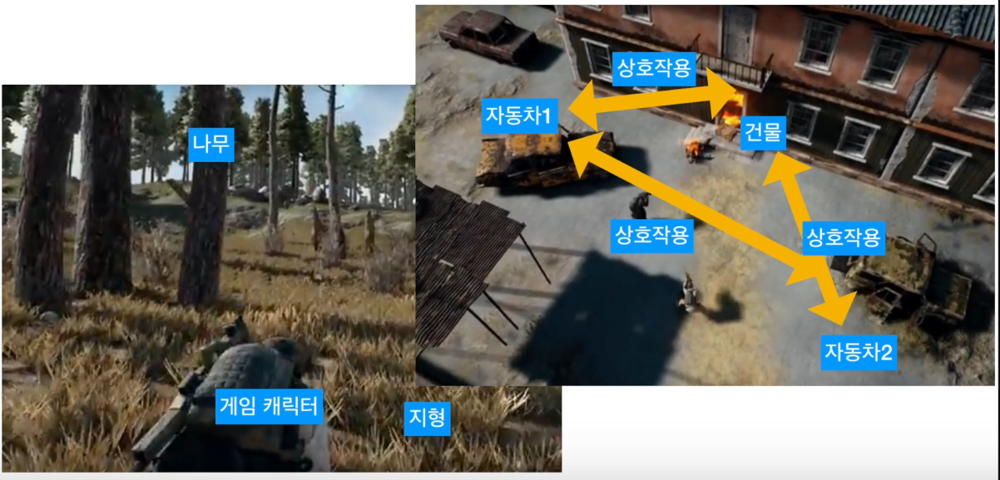
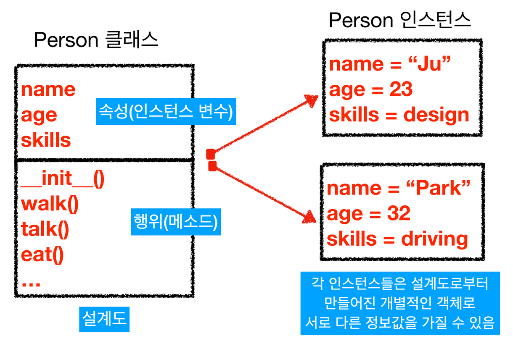
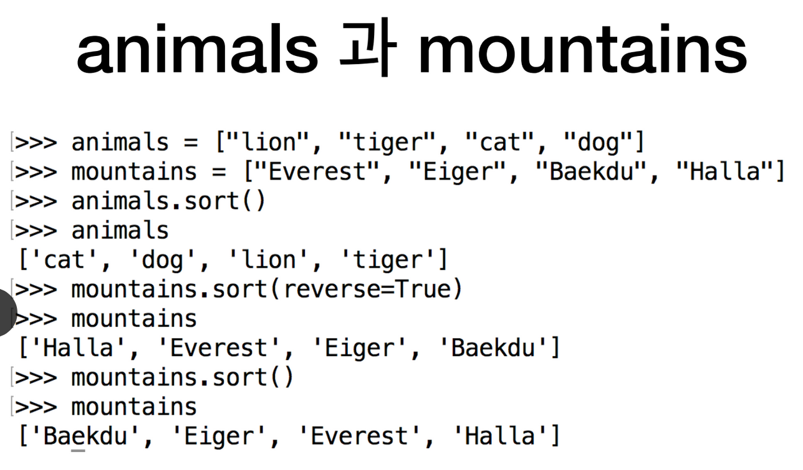
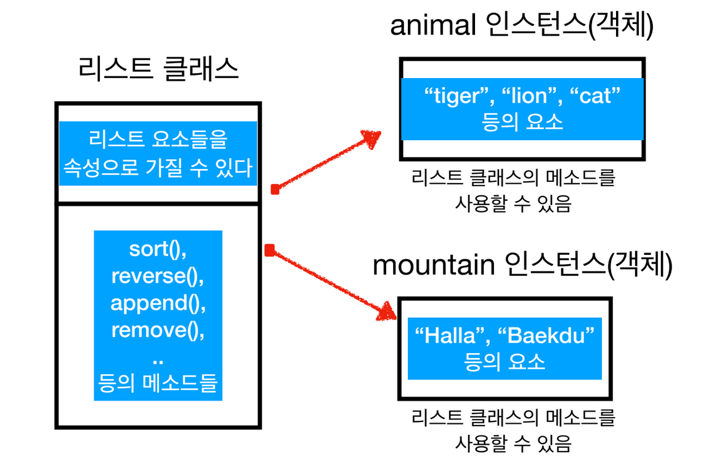
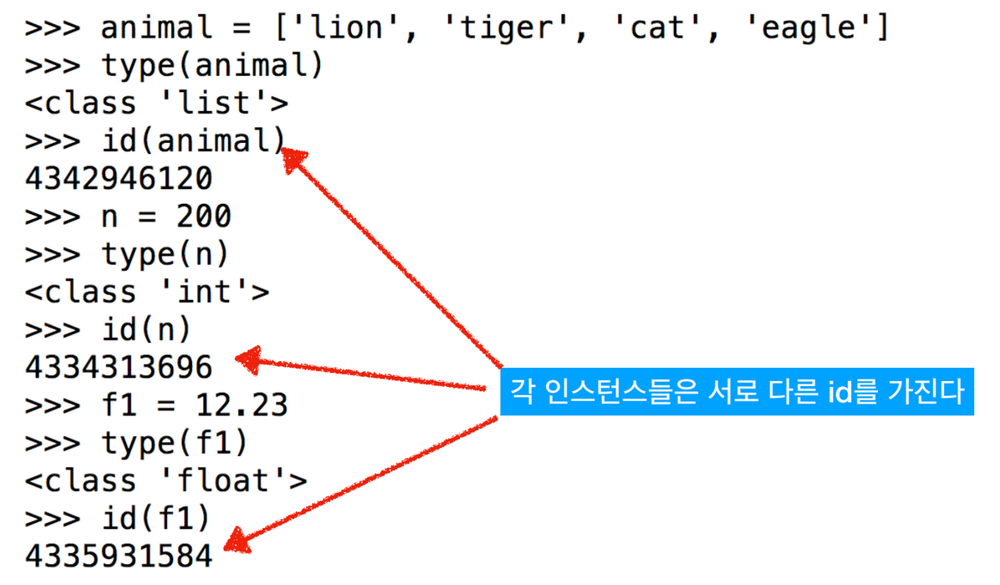

# 1. 객체 지향 프로그래밍

## 객체 지향 프로그래밍

* 프로그래밍을 실제 세상에 가깝게 모델링 하는 기법으로, 컴퓨터가 수행하는 작업을 객체들간의 상호 작용으로 표현하여 클래스 혹은 객체들의 집합으로 소프트웨어를 개발함
* 절차적 프로그래밍에 비하여 생산성이 높다.
* 소프트웨어 개발을 효과적으로 하기 위한 기법
  * 개념 이해의 어려

## What is an Object?

* Everything is an object!

* 잘 설계된 클래스를 이용하여 객체\(Object\)를 만들
* 클래스는 속성 인스턴스 변수\)과 행위\(메서드\)를 가지도록 설계하고
  * 객체는 클래스에서 정의한 속성\(state\)과 행위\(behavior\)를 수행한다.
  * 소프트웨어상에서 객체의 상태 또는 속성은 인스턴스 변수로 표현
  * 행위 혹은 동작은 메서드로 표현

## 인스턴스\(Instance\)의 이해

### 클래스\(Class\)

* 속성\(인스턴스 변수\)과 행위\(메서드\)들을 모아 놓은 집합체로 객체의 설계도\(혹은 template\)이다. 또는 청사진\(blueprint\)라고도 한다.

### 인스턴스\(Instance\)

* 클래스로부터 만들어지는 각각의 객체를 그 클래스의 인스턴스라고 한다.
* 서로 다른 인스턴스는 서로 다른 속성 값을 가질 수 있다.

## 파이썬에서는 모든 것이 객체\(Object\)이다. 

* 자료형
* 컬렉션
* 함수
* 모듈 모두 객체이다.

## type\( \) 함수와 id\( \)

* type\( \)은 입력 값의 자료형을 알려주는 함수
* animal = \["lion", "tiger"\]의 경우 type\(animal\)을 통해 animal 객체가 리스트 클래스 자료형 이라는 것을 알 수 있다.
  * 리스트 클래스는 멤버변수\(인스턴스 변수, 속성\)과 행위\(메서드\)를 가지는데 이 경우 멤버변수는 "lion", "tiger"이고 행위는 append\( \), sort\( \), reverse\( \), insert\( \), remove\( \)등이 있다
  * 우리는 리스트 클래스를 사용하여 리스트에서 사용할 수 있는 많은 작들을 효율적으로 수행할 수 있다.
* 또한 파이썬의 모든 객체는 고유의 id를 가진다.

## 정수도 객체이다.

* 3, 4와 같은 정수 자료형도 실제로는 int 클래스 타입의 객체이다.
* 3 + 4와 같은 연산자는 실제로 \(3\).\_\_add\_\_\(4\)와 같이 \_\_add\_\_\( \) 메서드의 호출로 구현되어 있다.
* &gt;&gt;&gt; 3 + 4
* 7
* &gt;&gt;&gt; \(3\).\_\_add\_\_\(4\)
* 7

## 캡슐화

* list 클래스는 sort\( \), reverse\( \), append\( \), remove\( \), ...의 많은 메서드를 제공하여 우리는 편리하게 호출할 수 있다.
  * 이를 공용 인터페이스라고 한다
* 이 메서드의 구체적인 구현 내용은 몰라도 된다. 이렇게 공용 인터페이스만 제공하고 세부적인 사항을 감추는 것을 캡슐화\(encapsulation\)라고 한다.

