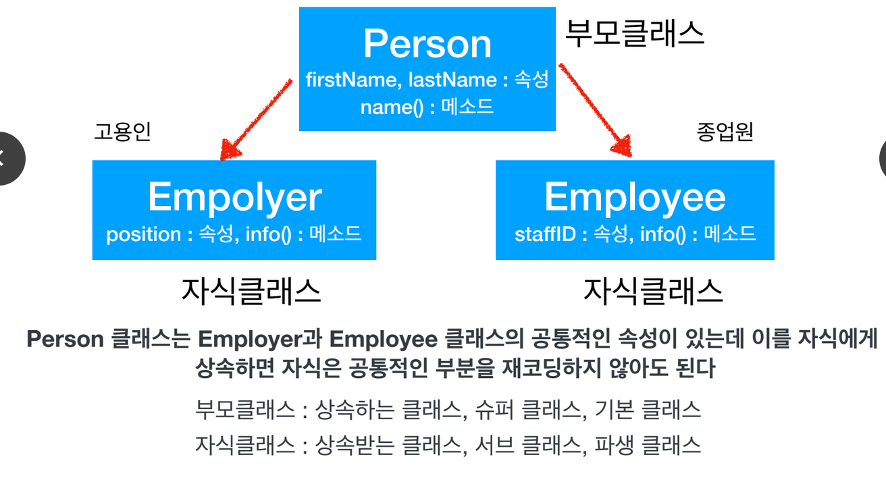
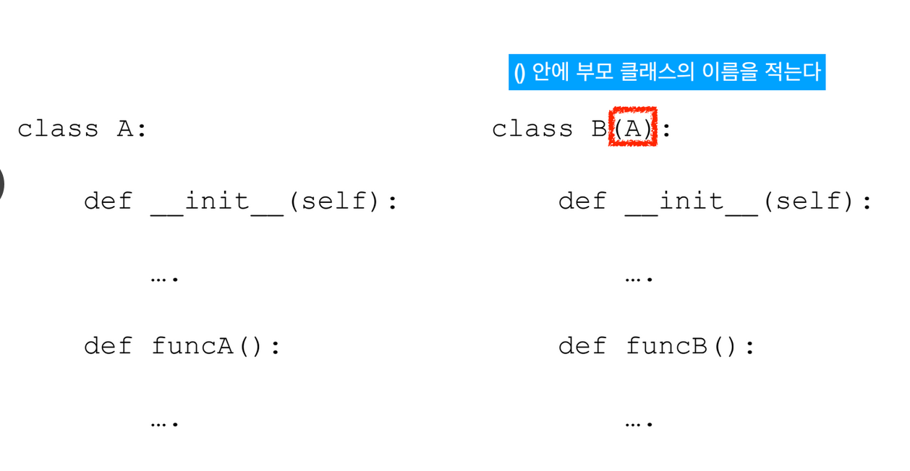
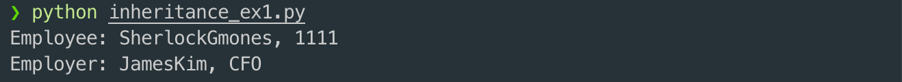
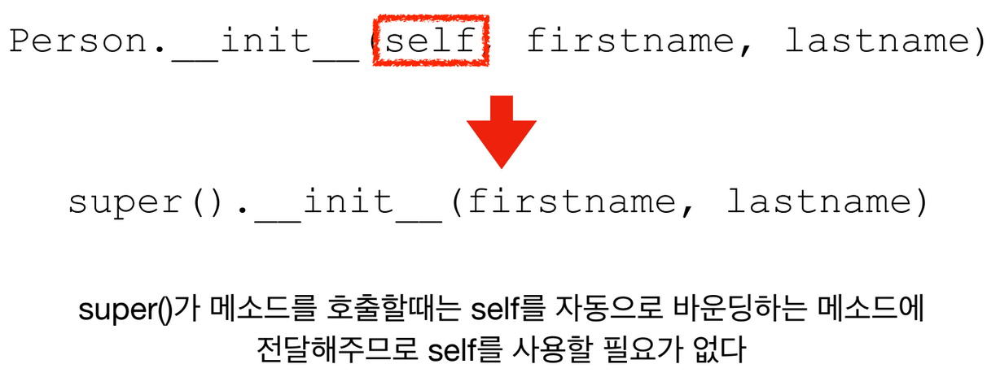
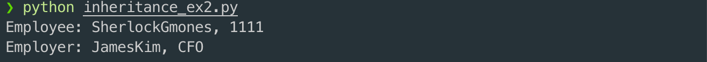
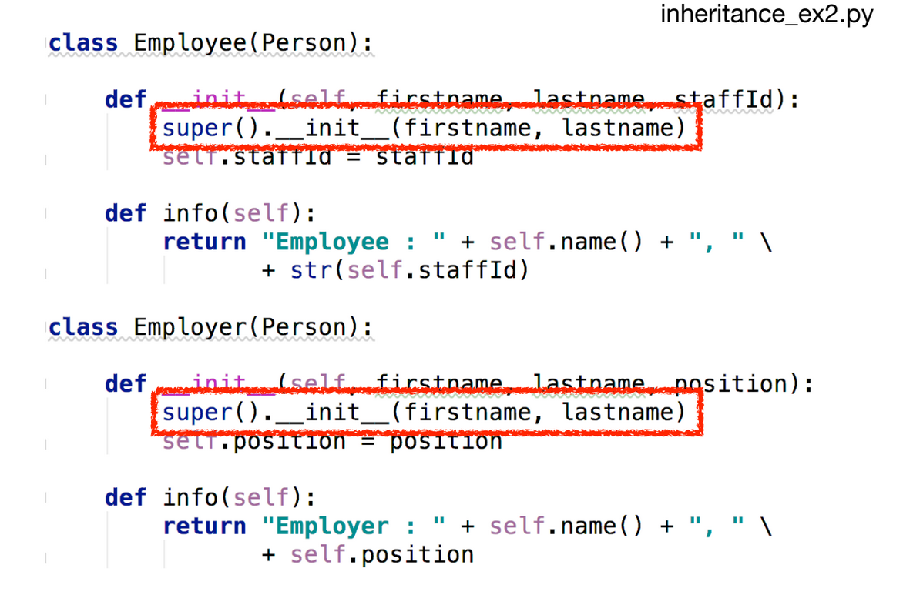

# 1. 상속\(Inheritance\)과 super\( \)

## 상속\(Inheritance\)


* 우리는 예전에 만들어진 코드를 이용하여 새로운 기능을 개발하는 경우가 많다
* 클래스의 상속 기능을 사용하면 부모 클래스에서 만들어둔 기능과 속성을 물려받을 수 있다.
* 상속은 객체지향 프로그래밍의 매우 뛰어난 기능이다.
* 새 클래스를 정의할 때 기존의 클래스를 사용한다.

## 상속의 예



## 문법



```python
class Person:
    def __init__(self, firstname, lastname):
        self.firstname = firstname
        self.lastname = lastname

    def name(self):
        return self.firstname + self.lastname

class Employer(Person):
    def __init__(self, firstname, lastname, position):
        Person.__init__(self, firstname, lastname)
        self.position = position

    def info(self):
        return "Employer: {}, {}".format(self.name(), self.position)

class Employee(Person):
    def __init__(self, firstname, lastname, staffId):
        Person.__init__(self, firstname, lastname)
        self.staffId = staffId
    
    def info(self):
        return "Employee: {}, {}".format(self.name(), self.staffId)

worker = Employee("Sherlock", "Gmones", 1111)
cfo = Employer("James", "Kim", "CFO")

print(worker.info())
print(cfo.info())
```



## super\( \)

* 부모 클래스의 이름을 알고 있을 경우 Person.\_\_init\_\_ 과 같이 부모 클래스의 이름과 . 을 사용하여 부모클래스의 메서드를 호출 할 수 있다
  * 하지만 super\( \) 를 통해 부모 클래스의 메서드를 손쉽게 이용할 수 있다
  * 부모 클래스를 명시적으로 적어줄 필요가 없으므로 프로그램의 유지 보수가 쉽다.




```python
class Person:
    def __init__(self, firstname, lastname):
        self.firstname = firstname
        self.lastname = lastname

    def name(self):
        return self.firstname + self.lastname

class Employer(Person):
    def __init__(self, firstname, lastname, position):
        super().__init__(firstname, lastname)
        self.position = position

    def info(self):
        return "Employer: {}, {}".format(self.name(), self.position)

class Employee(Person):
    def __init__(self, firstname, lastname, staffId):
        super().__init__(firstname, lastname)
        self.staffId = staffId
    
    def info(self):
        return "Employee: {}, {}".format(self.name(), self.staffId)

worker = Employee("Sherlock", "Gmones", 1111)
cfo = Employer("James", "Kim", "CFO")

print(worker.info())
print(cfo.info())
```






