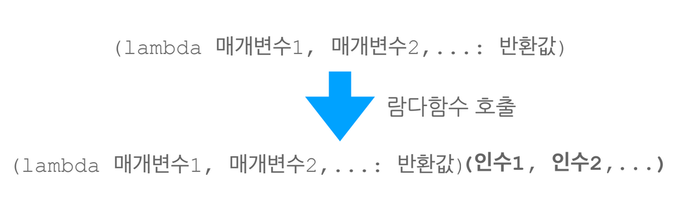
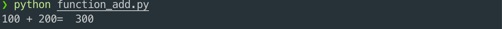
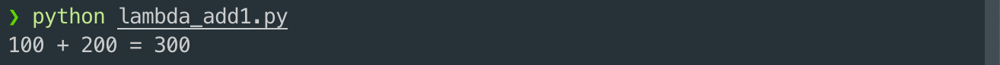
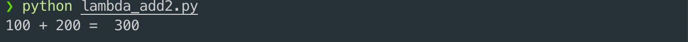
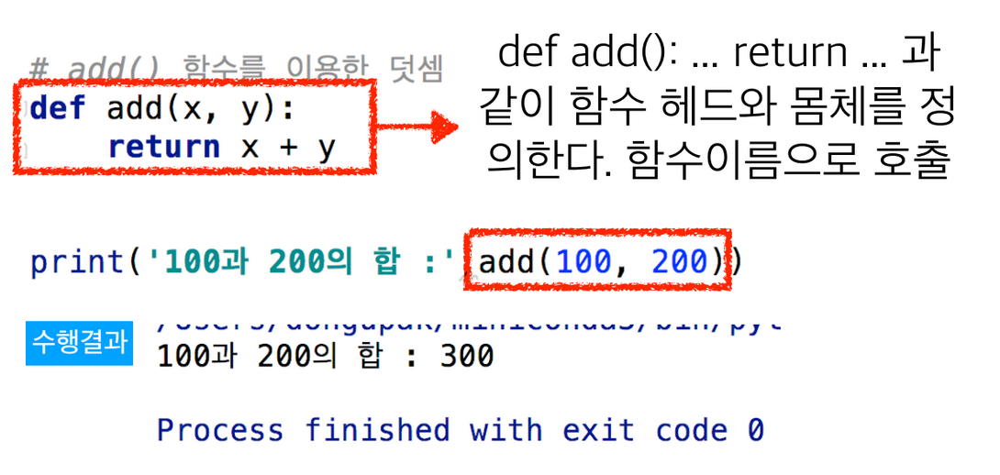
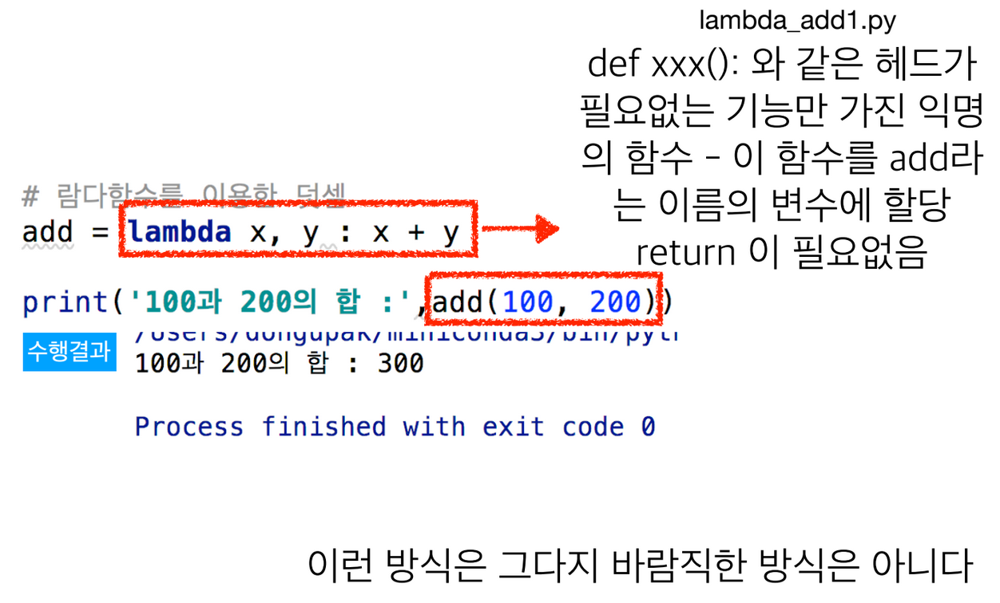
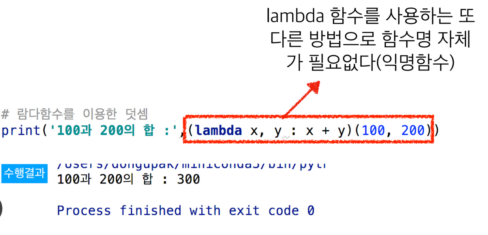
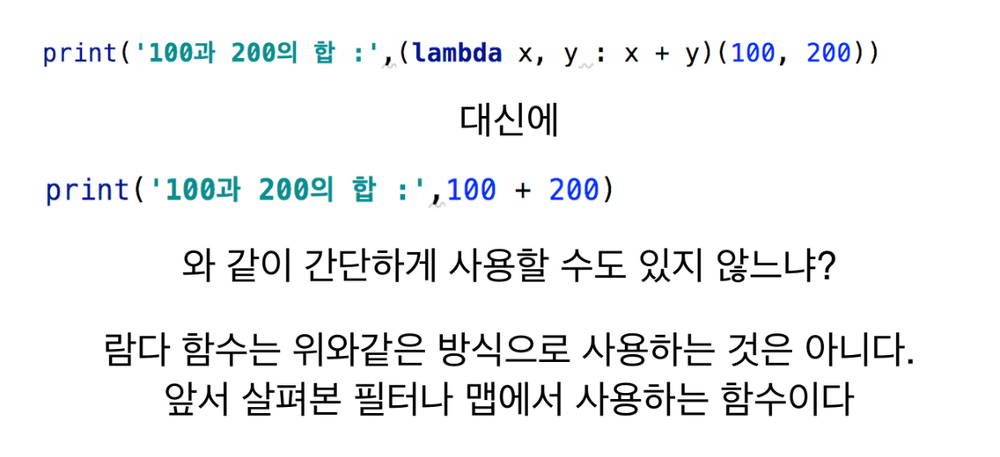

# 1. 람다 함수\(Lambda Expression\)

## 일반 함수와 람다 함수

* 함수를 이용하면 필요한 기능의 재사용이 가능하다
  * 함수를 정의한 후 필요할 때마다 호출하여 사용
* 가끔씩은 함수를 만들지 않고 함수화된 기능만을 불러 사용하고자 할 경우가 있
  *  프로그램을 단순하게 만들 수 있다. 
  * 1회용으로 함수를 만들고 싶은데 def xxx\( \): 과 같은 이름을 짓는 것이 번거롭게 느껴질 수 있다

## 람다 함수

* 람다, 람다 표현식라고도 불리우는 람다 함수는 이름이 없는 함수
  * 익명 함수\(anonymous function\)로 부르기도 함
  * 이름이 필요할 경우 할당하여 사용할 수 있다
* 주의: 표현식 안에서 새 변수를 선언할 수 없다
* 변환값은 변수 없이 식 한 줄로 표현할 수 있어야 하며 복잡한 함수가 필요하면 def 로 함수를 정의하여야 한다.
  * return 문이 필요없다.

## 람다 함수의 모양과 호출



```python
# add( ) 함수를 이용한 덧셈
def add(x, y):
    return x + y

print('100 + 200= ', add(100, 200))
```



```python
# 람다함수를 이용한 덧셈
add = lambda x, y : x + y

print('100 + 200 =', add(100, 200))
```



* 람다 함수는 한 줄로 표시할 수 있으면 좋다. → 그래야 효용가치가 있으므로.  따라서,

```python
# 람다함수를 이용한 덧셈
print('100 + 200 = ', (lambda x, y : x + y)(100, 200))
```









## 의문




